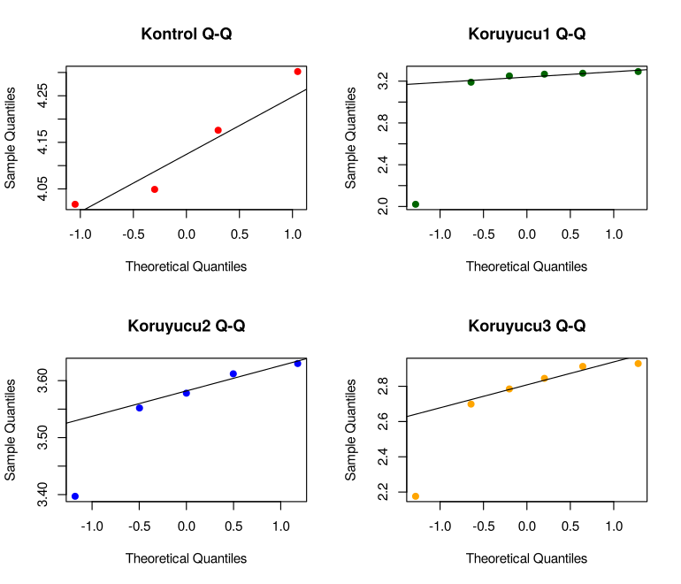
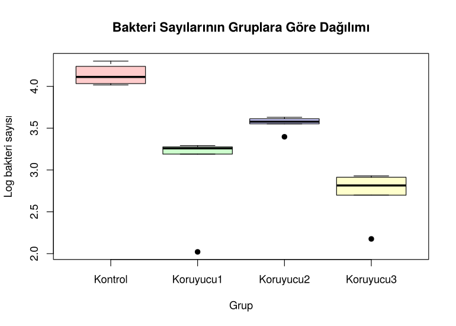
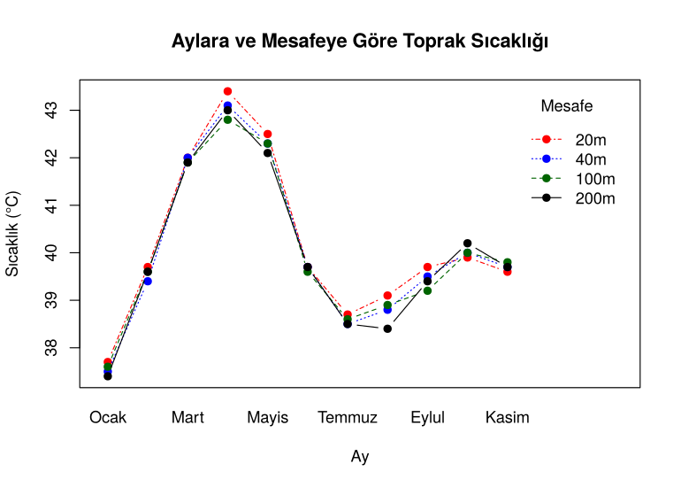
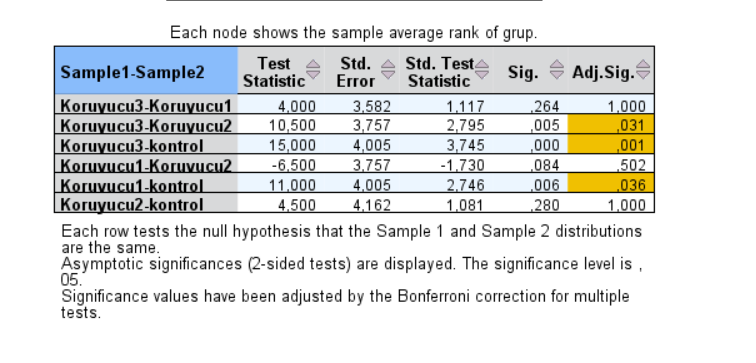

# Nonparametric Statistical Methods: Preservatives & Soil Temperature


> **This repository contains my assignment for İST377, where I applied nonparametric tests to two datasets using R and SPSS.
> ** This project answers two applied research questions with
> rank-based (nonparametric) tests, justifies every method choice with
> assumption checks, and cross-validates all results between **R** and **IBM SPSS**.

 **Full analysis with code, output and every plot → [`analiz.md`](analiz.md)** (written in Turkish)

---

##  Objective

The project works with two small experimental datasets and asks:

| | Research question | Data |
|---|---|---|
|  **Experiment 1** | Do food preservatives reduce bacterial growth, and **which ones** work? | Log bacteria counts: 1 control + 3 preservatives (n = 21) |
|  **Experiment 2** | Does the **distance from a shelterbelt** (windbreak) change soil temperature? | Soil temperature at 20 / 40 / 100 / 200 m, measured monthly Jan–Nov (n = 44) |

Beyond answering the questions, the aim is to show the full workflow of a
statistical analysis: **check assumptions → choose the right test → interpret
the result → verify it in a second tool.**

---

##  Why nonparametric tests?

Parametric tests (t-test, ANOVA) assume normally distributed data. The
assumption checks showed this does not hold for Experiment 1:

<p align="center">
  
</p>

- Shapiro-Wilk rejects normality for **Preservative 1 (p < 0.001)** and **Preservative 3 (p = 0.025)**.
- Groups are tiny (4–6 observations) and three of them contain an outlier.

Experiment 2 passes the normality test, but with only 11 observations per group,
an outlier at 20 m and repeated measurements on the same months, a rank-based
test that accounts for the **block (month) structure** is the safer choice.


---

##  Results

###  Experiment 1 – Preservatives work, but not equally

<p align="center">
  
</p>

The four groups differ significantly (**Kruskal-Wallis, p < 0.001**). Dunn's
post-hoc test (Bonferroni-adjusted) shows where the differences are:

| Comparison | Adjusted p | Result |
|---|---:|---|
| Control vs. Preservative 1 | 0.036 | ✅ significantly lower bacteria |
| Control vs. Preservative 3 | 0.001 | ✅ significantly lower bacteria |
| Control vs. Preservative 2 | 1.000 | ❌ no significant difference |
| Preservative 2 vs. Preservative 3 | 0.031 | ✅ Preservative 3 is more effective |

**Takeaway:** Preservatives 1 and 3 clearly suppress bacterial growth;
Preservative 3 is the most effective. Preservative 2 looks better than the
control on its own (Mann-Whitney, p = 0.016), but this difference does not
survive correction for multiple comparisons.

###  Experiment 2 – Distance has no effect; the season does

<p align="center">
  
</p>

The four distance lines lie almost on top of each other while all of them rise
and fall with the season.

- **Friedman test (months as blocks): p = 0.066** → no significant effect of distance.
- **20 m vs. 200 m (paired Wilcoxon): p = 0.046–0.051**, borderline depending on
  the method; the mean difference is only **0.19 °C**, which is practically negligible.
- **Mann-Kendall trend test at 20 m: p = 0.94** → no monotonic trend; the pattern
  is seasonal (up until April, then down), not a steady increase or decrease.

### Summary

| # | Question | Test | Result (α = 0.05) |
|---|---|---|---|
| 3 | Is the median of Preservative 2 equal to 3.5? | Sign test, Wilcoxon | Not different (p = 0.375, 0.313) |
| 4 | Control vs. Preservative 2 | Mann-Whitney U | Different (p = 0.016) |
| 5 | 20 m vs. 200 m | Paired Wilcoxon | Borderline (p = 0.046–0.051) |
| 6 | All four bacteria groups | Kruskal-Wallis + Dunn | Different (p < 0.001) |
| 7 | All four distances | Friedman | Not different (p = 0.066) |
| 8 | Trend over months (20 m) | Mann-Kendall | No trend (p = 0.94) |

---

##  R vs. SPSS

Every test was run in both tools to verify the results. SPSS output is shown
under each question in [`analiz.md`](analiz.md). For example, the Dunn post-hoc
test implemented in R reproduces the SPSS output exactly:

<p align="center">
  
</p>

Where the two tools differ, the reason is explained:

- **Wilcoxon tests:** R gives exact p-values for small samples, SPSS gives
  asymptotic ones. For the paired test SPSS omits the continuity correction,
  which moves the p-value from 0.051 (R) to 0.046 (SPSS), right across the 0.05 line.
- **Mann-Kendall** is not available in SPSS menus, so it was run only in R.

---


##  Project structure

```
├── analiz.Rmd      # Source analysis (R Markdown)
├── analiz.md       # Rendered report, viewable on GitHub
├── data/           # Input datasets (CSV)
├── figures/        # Plots generated by analiz.Rmd
└── spss/           # IBM SPSS output screenshots
```

##  Reproducing

Requires R ≥ 4.1:

```r
install.packages(c("dplyr", "knitr", "rmarkdown"))
rmarkdown::render("analiz.Rmd")
```

The sign test and Mann-Kendall test are implemented in base R and give the same
results as `BSDA::SIGN.test` and `Kendall::MannKendall`, so no extra packages are needed.

---

##  About

Course assignment for *İST377 Nonparametric Statistical Methods*, autumn 2026.
The code was cleaned up, documented and published in October 2026.

**Author:** Meryem Bakır

### References

- Higgins, J. J. (2004). *Introduction to Modern Nonparametric Statistics*. Brooks/Cole.
- Hollander, M., & Wolfe, D. A. (1999). *Nonparametric Statistical Methods* (2nd ed.). Wiley.
