İST377 – Parametrik Olmayan İstatistiksel Yöntemler
================

- [Kurulum ve veri](#kurulum-ve-veri)
- [Soru 1 – Bakteri verisi: betimsel analiz ve
  normallik](#soru-1--bakteri-verisi-betimsel-analiz-ve-normallik)
- [Soru 2 – Toprak sıcaklığı verisi: betimsel analiz ve
  normallik](#soru-2--toprak-sıcaklığı-verisi-betimsel-analiz-ve-normallik)
- [Soru 3 – Tek örneklem konum testleri (Koruyucu
  2)](#soru-3--tek-örneklem-konum-testleri-koruyucu-2)
- [Soru 4 – Bağımsız iki örneklem testi (Kontrol – Koruyucu
  2)](#soru-4--bağımsız-iki-örneklem-testi-kontrol--koruyucu-2)
- [Soru 5 – Bağımlı iki örneklem testi (20 m – 200
  m)](#soru-5--bağımlı-iki-örneklem-testi-20-m--200-m)
- [Soru 6 – k bağımsız örneklem testi
  (Kruskal-Wallis)](#soru-6--k-bağımsız-örneklem-testi-kruskal-wallis)
- [Soru 7 – k bağımlı örneklem testi
  (Friedman)](#soru-7--k-bağımlı-örneklem-testi-friedman)
- [Soru 8 – Eğilim testi (Mann-Kendall, 20
  m)](#soru-8--eğilim-testi-mann-kendall-20-m)
- [Sonuç özeti](#sonuç-özeti)
- [Kaynaklar](#kaynaklar)

Bu dosya, iki küçük veri seti üzerinde parametrik olmayan hipotez
testlerini R ile uygular. Her sorunun altında aynı analizin **IBM SPSS**
çıktısı da yer alır; böylece iki aracın sonuçları karşılaştırılabilir.

| Veri seti                                | Tasarım                          | Kullanılan sorular |
|------------------------------------------|----------------------------------|--------------------|
| Koruyucu madde – bakteri sayısı          | 4 bağımsız grup (n = 4, 6, 5, 6) | 1, 3, 4, 6         |
| Rüzgâr kırana uzaklık – toprak sıcaklığı | 4 mesafe × 11 ay (bloklu)        | 2, 5, 7, 8         |

Tüm testlerde anlamlılık düzeyi **α = 0.05** alınmıştır.

## Kurulum ve veri

``` r
library(dplyr)

bakteri <- read.csv("data/bakteri_koruyucu.csv") |>
  mutate(grup = factor(grup, levels = c("Kontrol", "Koruyucu1", "Koruyucu2", "Koruyucu3")))

toprak <- read.csv("data/toprak_sicakligi.csv") |>
  mutate(
    mesafe = factor(mesafe, levels = c("20m", "40m", "100m", "200m")),
    ay     = factor(ay, levels = unique(ay[order(ay_no)]))
  )

# Eşleştirilmiş testler için geniş format: her satır bir ay, her sütun bir mesafe
toprak_genis <- sapply(split(toprak$sicaklik, toprak$mesafe), identity)
rownames(toprak_genis) <- levels(toprak$ay)

# Grup bazında vektörler (bazı testler vektör bekler)
grp <- split(bakteri$log_bakteri, bakteri$grup)
```

Özetleyici istatistikler için yardımcı fonksiyon:

``` r
ozetle <- function(df, deger, grup) {
  df |>
    group_by({{ grup }}) |>
    summarise(
      N = n(), Ortalama = mean({{ deger }}), Medyan = median({{ deger }}),
      Std_Sapma = sd({{ deger }}), Min = min({{ deger }}), Max = max({{ deger }})
    ) |>
    mutate(across(where(is.double), \(x) round(x, 3)))
}
```

## Soru 1 – Bakteri verisi: betimsel analiz ve normallik

``` r
knitr::kable(ozetle(bakteri, log_bakteri, grup))
```

| grup      |   N | Ortalama | Medyan | Std_Sapma |   Min |   Max |
|:----------|----:|---------:|-------:|----------:|------:|------:|
| Kontrol   |   4 |    4.136 |  4.113 |     0.130 | 4.017 | 4.302 |
| Koruyucu1 |   6 |    3.049 |  3.258 |     0.505 | 2.021 | 3.292 |
| Koruyucu2 |   5 |    3.554 |  3.578 |     0.093 | 3.397 | 3.630 |
| Koruyucu3 |   6 |    2.724 |  2.815 |     0.282 | 2.176 | 2.929 |

``` r
boxplot(log_bakteri ~ grup, data = bakteri,
        main = "Bakteri Sayılarının Gruplara Göre Dağılımı",
        xlab = "Grup", ylab = "Log bakteri sayısı",
        col = c("#ffcccc", "#ccffcc", "#ccccff", "#ffffcc"), pch = 19)
```

<!-- -->

``` r
# Boxplot'ta aykırı değer olarak işaretlenen gözlemler
lapply(grp, \(x) boxplot.stats(x)$out)
```

    ## $Kontrol
    ## numeric(0)
    ## 
    ## $Koruyucu1
    ## [1] 2.021
    ## 
    ## $Koruyucu2
    ## [1] 3.397
    ## 
    ## $Koruyucu3
    ## [1] 2.176

**Yorum.** Kontrol grubunun medyanı (≈ 4.11) en yüksek değerdir; üç
koruyucu grubunun medyanları kontrolün belirgin biçimde altındadır ve en
düşük medyan Koruyucu 3’tedir (≈ 2.82). Koruyucu 1, 2 ve 3 gruplarının
her birinde birer **aşağı yönlü** aykırı değer bulunmaktadır (2.021,
3.397 ve 2.176). Aykırı değerler ve gruplar arasında değişen yayılım,
normallik varsayımının sağlanmayabileceğine işaret etmektedir.

``` r
sapply(grp, \(x) {
  sw <- shapiro.test(x)
  c(W = round(unname(sw$statistic), 4), p = round(sw$p.value, 4))
})
```

    ##   Kontrol Koruyucu1 Koruyucu2 Koruyucu3
    ## W  0.9253    0.5571    0.8344    0.7606
    ## p  0.5673    0.0001    0.1500    0.0252

``` r
par(mfrow = c(2, 2))
renkler <- c("red", "darkgreen", "blue", "orange")
for (i in seq_along(grp)) {
  qqnorm(grp[[i]], main = paste(names(grp)[i], "Q-Q"), col = renkler[i], pch = 19)
  qqline(grp[[i]])
}
```

<!-- -->

``` r
par(mfrow = c(1, 1))
```

**Yorum.** Shapiro-Wilk testine göre Kontrol (p = 0.567) ve Koruyucu 2
(p = 0.150) grupları normal dağılımdan anlamlı sapma göstermezken
Koruyucu 1 (p \< 0.001) ve Koruyucu 3 (p = 0.025) grupları normal
dağılmamaktadır. Q-Q grafiklerinde de bu iki grupta noktaların doğrudan
uzaklaştığı görülür. Parametrik tek yönlü ANOVA tüm grupların normal
dağılmasını gerektirdiği için bu veri seti parametrik olmayan
yöntemlerle incelenmiştir.

<details>
<summary>
<b>SPSS çıktıları</b>
</summary>

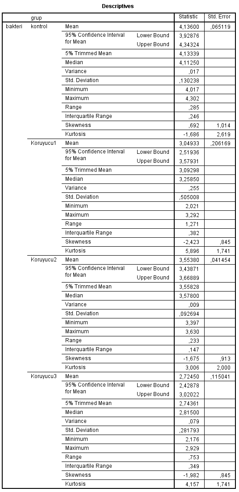 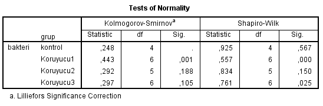
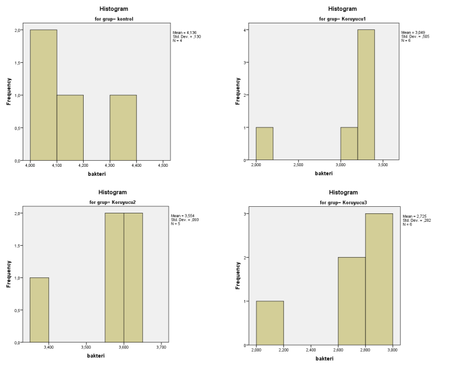 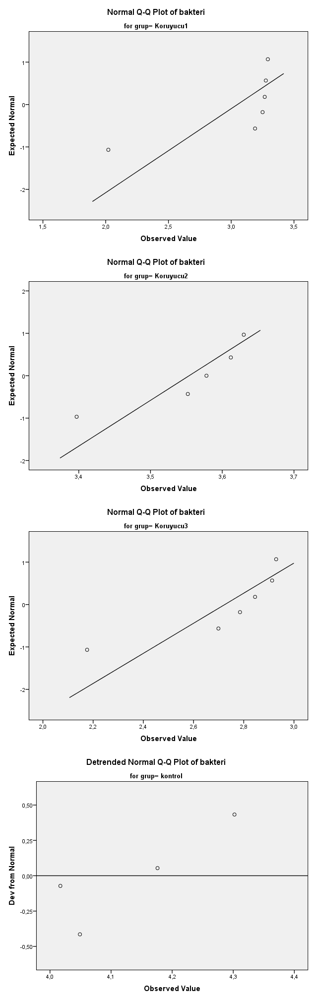 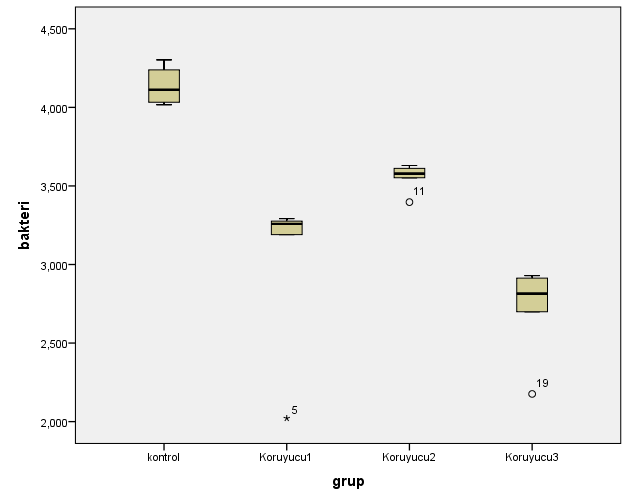

</details>

## Soru 2 – Toprak sıcaklığı verisi: betimsel analiz ve normallik

``` r
knitr::kable(ozetle(toprak, sicaklik, mesafe))
```

| mesafe |   N | Ortalama | Medyan | Std_Sapma |  Min |  Max |
|:-------|----:|---------:|-------:|----------:|-----:|-----:|
| 20m    |  11 |   40.182 |   39.7 |     1.723 | 37.7 | 43.4 |
| 40m    |  11 |   40.045 |   39.7 |     1.721 | 37.5 | 43.1 |
| 100m   |  11 |   40.027 |   39.6 |     1.633 | 37.6 | 42.8 |
| 200m   |  11 |   39.991 |   39.7 |     1.713 | 37.4 | 43.0 |

Veriler aynı aylarda tekrarlı ölçüldüğü için önce zaman içindeki seyir
incelenmiştir:

``` r
interaction.plot(x.factor = toprak$ay, trace.factor = toprak$mesafe,
                 response = toprak$sicaklik, type = "b", pch = 19,
                 col = c("red", "blue", "darkgreen", "black"), fixed = TRUE,
                 xlab = "Ay", ylab = "Sıcaklık (°C)", trace.label = "Mesafe",
                 main = "Aylara ve Mesafeye Göre Toprak Sıcaklığı")
```

<!-- -->

**Yorum.** Dört mesafenin çizgileri neredeyse üst üste binmektedir.
Sıcaklıktaki değişimi belirleyen asıl etken ay (mevsim) olup mesafenin
ayrıştırıcı bir etkisi görsel olarak fark edilmemektedir.

``` r
boxplot(sicaklik ~ mesafe, data = toprak,
        main = "Mesafelere Göre Sıcaklık Dağılımı",
        xlab = "Mesafe", ylab = "Sıcaklık (°C)",
        col = c("orange", "lightblue", "lightgreen", "gray"))
```

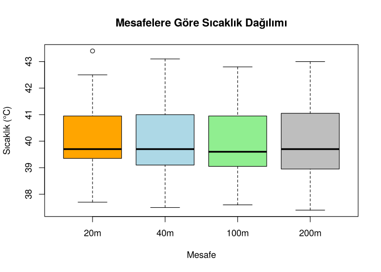<!-- -->

``` r
lapply(split(toprak$sicaklik, toprak$mesafe), \(x) boxplot.stats(x)$out)
```

    ## $`20m`
    ## [1] 43.4
    ## 
    ## $`40m`
    ## numeric(0)
    ## 
    ## $`100m`
    ## numeric(0)
    ## 
    ## $`200m`
    ## numeric(0)

``` r
sapply(split(toprak$sicaklik, toprak$mesafe), \(x) {
  sw <- shapiro.test(x)
  c(W = round(unname(sw$statistic), 4), p = round(sw$p.value, 4))
})
```

    ##      20m    40m   100m   200m
    ## W 0.8938 0.9200 0.9173 0.9407
    ## p 0.1551 0.3184 0.2965 0.5293

``` r
par(mfrow = c(2, 2))
for (i in seq_len(ncol(toprak_genis))) {
  qqnorm(toprak_genis[, i], main = paste(colnames(toprak_genis)[i], "Q-Q"),
         col = c("red", "blue", "darkgreen", "gray30")[i], pch = 19)
  qqline(toprak_genis[, i])
}
```

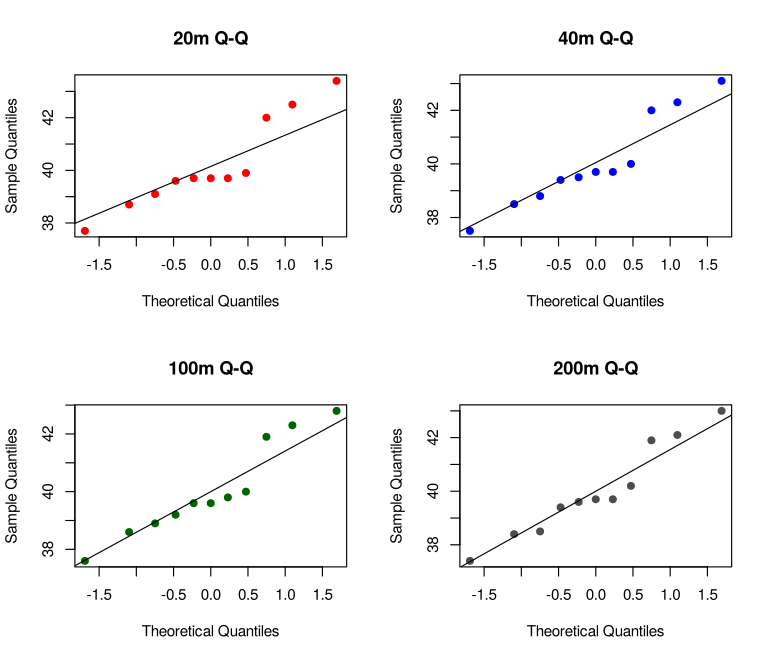<!-- -->

``` r
par(mfrow = c(1, 1))
```

**Yorum.** Shapiro-Wilk sonuçlarına göre dört mesafe de normallik
varsayımını sağlamaktadır (tüm p \> 0.15). Ancak her grupta yalnızca n =
11 gözlem olduğundan testin gücü düşüktür. Ayrıca 20 m grubunda bir
aykırı değer (43.4 °C) bulunmaktadır ve gözlemler aylara göre
bağımlıdır. Bu nedenlerle mesafeler arası karşılaştırma, aykırı
değerlere dayanıklı ve blok yapısını dikkate alan **Friedman testi** ile
yapılmıştır (bkz. Soru 7).

<details>
<summary>
<b>SPSS çıktıları</b>
</summary>

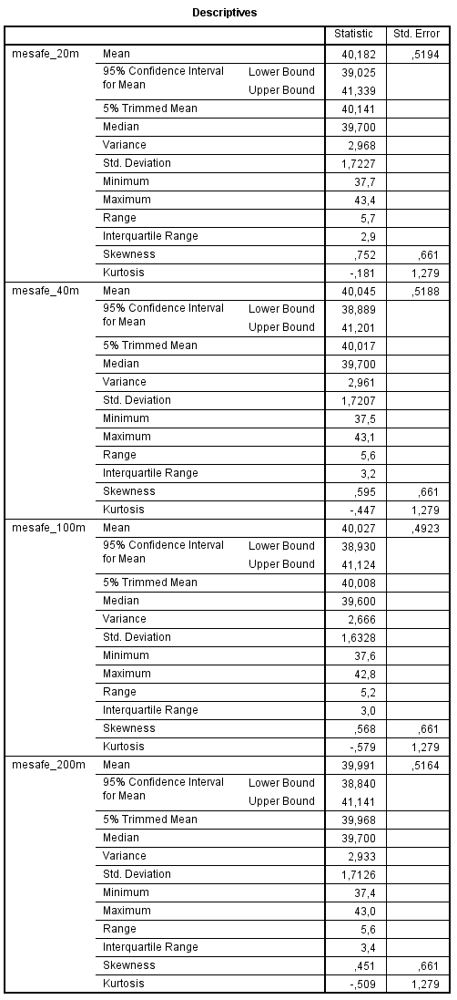 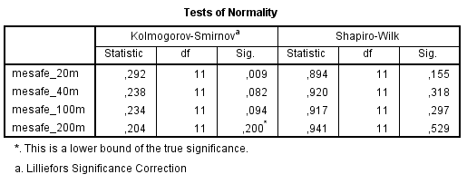
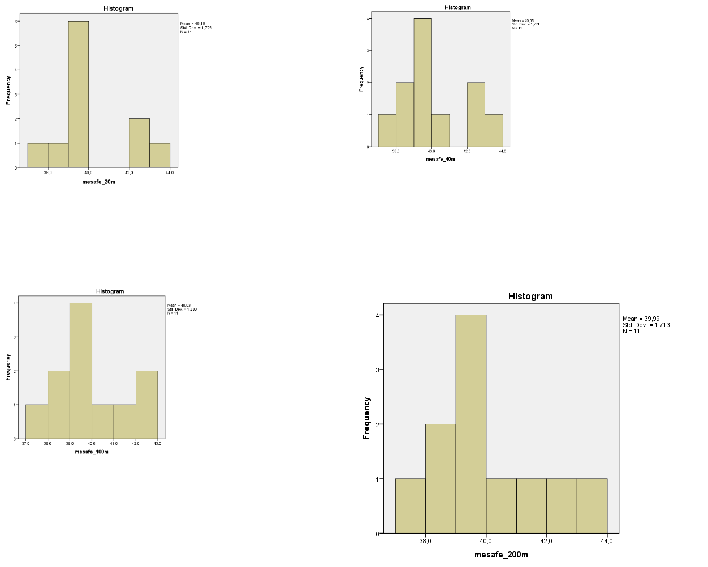 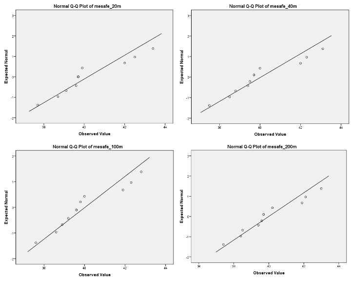

</details>

## Soru 3 – Tek örneklem konum testleri (Koruyucu 2)

- H₀: Koruyucu 2 grubunun medyanı 3.5’e eşittir.
- H₁: Medyan 3.5’ten farklıdır.

``` r
m0 <- 3.5
x  <- grp$Koruyucu2

# İşaret testi: 3.5'ten büyük gözlem sayısı ~ Binom(n, 0.5)
# (BSDA::SIGN.test ile aynı sonucu verir)
isaret <- binom.test(sum(x > m0), sum(x != m0), p = 0.5)
isaret
```

    ## 
    ##  Exact binomial test
    ## 
    ## data:  sum(x > m0) and sum(x != m0)
    ## number of successes = 4, number of trials = 5, p-value = 0.375
    ## alternative hypothesis: true probability of success is not equal to 0.5
    ## 95 percent confidence interval:
    ##  0.2835821 0.9949492
    ## sample estimates:
    ## probability of success 
    ##                    0.8

``` r
# Wilcoxon işaretli sıra testi
wilcox.test(x, mu = m0, alternative = "two.sided")
```

    ## 
    ##  Wilcoxon signed rank exact test
    ## 
    ## data:  x
    ## V = 12, p-value = 0.3125
    ## alternative hypothesis: true location is not equal to 3.5

**Yorum.** İşaret testinde p = 0.375, Wilcoxon işaretli sıra testinde p
= 0.313 bulunmuştur. Her iki p-değeri de 0.05’ten büyük olduğundan H₀
reddedilemez: %95 güven düzeyinde Koruyucu 2 grubunun medyanının
**3.5’ten** istatistiksel olarak anlamlı farklı olmadığı söylenebilir.
Grubun örneklem medyanı 3.578’dir.

> SPSS, Wilcoxon testi için asimptotik p = 0.225 verirken R, örneklem
> küçük ve eşit değer olmadığı için kesin (exact) p = 0.313 hesaplar.
> Sonuç değişmez.

<details>
<summary>
<b>SPSS çıktıları</b>
</summary>

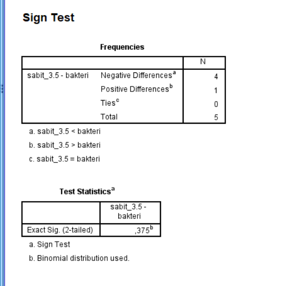 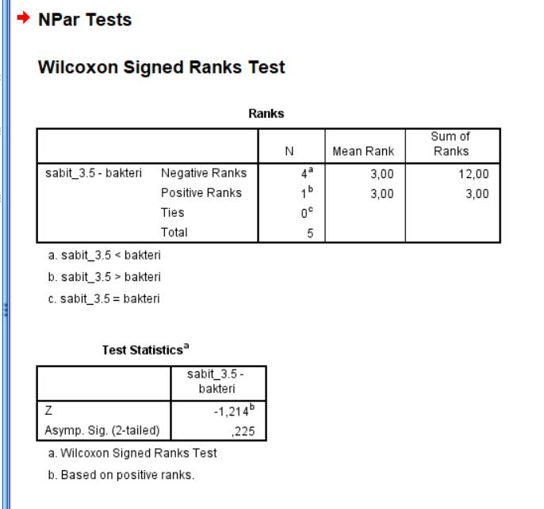

</details>

## Soru 4 – Bağımsız iki örneklem testi (Kontrol – Koruyucu 2)

- H₀: Kontrol ve Koruyucu 2 gruplarının dağılımları (medyanları)
  aynıdır.
- H₁: İki grubun medyanları farklıdır.

``` r
mw <- wilcox.test(grp$Kontrol, grp$Koruyucu2, paired = FALSE)
mw
```

    ## 
    ##  Wilcoxon rank sum exact test
    ## 
    ## data:  grp$Kontrol and grp$Koruyucu2
    ## W = 20, p-value = 0.01587
    ## alternative hypothesis: true location shift is not equal to 0

``` r
sapply(grp[c("Kontrol", "Koruyucu2")], median)
```

    ##   Kontrol Koruyucu2 
    ##    4.1125    3.5780

**Yorum.** Mann-Whitney U testinde p = 0.0159 \< 0.05 olduğundan H₀
reddedilir. Kontrol grubunun medyanı (4.11), Koruyucu 2 grubunun
medyanından (3.58) yüksektir; yani Koruyucu 2, bu ikili karşılaştırmada
bakteri sayısını anlamlı biçimde düşürmektedir.

> Bu karşılaştırma tek başına, çoklu karşılaştırma düzeltmesi yapılmadan
> yapılmıştır. Dört grubun hepsi birlikte incelendiğinde (Soru 6) aynı
> fark düzeltme sonrasında anlamlı çıkmamaktadır.

<details>
<summary>
<b>SPSS çıktıları</b>
</summary>

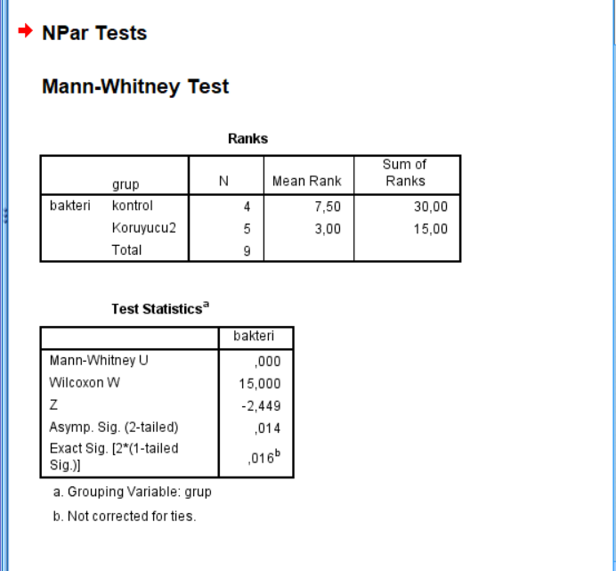

</details>

## Soru 5 – Bağımlı iki örneklem testi (20 m – 200 m)

- H₀: 20 m ve 200 m mesafelerdeki sıcaklıklar arasında fark yoktur.
- H₁: İki mesafenin sıcaklık medyanları farklıdır.

``` r
fark <- toprak_genis[, "20m"] - toprak_genis[, "200m"]
fark
```

    ##    Ocak   Subat    Mart   Nisan   Mayis Haziran  Temmuz Agustos   Eylul    Ekim 
    ##     0.3     0.1     0.1     0.4     0.4     0.0     0.2     0.7     0.3    -0.3 
    ##   Kasim 
    ##    -0.1

``` r
# R varsayılanı: süreklilik düzeltmeli normal yaklaşım
w_duz <- wilcox.test(toprak_genis[, "20m"], toprak_genis[, "200m"], paired = TRUE)
w_duz
```

    ## 
    ##  Wilcoxon signed rank test with continuity correction
    ## 
    ## data:  toprak_genis[, "20m"] and toprak_genis[, "200m"]
    ## V = 47, p-value = 0.05141
    ## alternative hypothesis: true location shift is not equal to 0

``` r
# SPSS ile aynı yaklaşım: süreklilik düzeltmesiz
w_spss <- wilcox.test(toprak_genis[, "20m"], toprak_genis[, "200m"],
                      paired = TRUE, correct = FALSE)
w_spss$p.value
```

    ## [1] 0.04557127

``` r
mean(fark)
```

    ## [1] 0.1909091

**Yorum.** Farklarda sıfır ve eşit değerler bulunduğu için kesin
p-değeri hesaplanamaz ve normal yaklaşım kullanılır. Süreklilik
düzeltmesi ile p = 0.0514, düzeltme olmadan (SPSS’in yöntemi) p = 0.0456
bulunmuştur. Sonuç **sınırdadır** ve kullanılan yaklaşıma göre 0.05
eşiğinin iki farklı tarafına düşmektedir. Bu nedenle kesin bir “fark
var” ya da “fark yok” yargısı yerine, 20 m’de sıcaklığın 200 m’ye göre
yüksek olma eğiliminde olduğu (11 aydan 8’inde yüksek) ancak ortalama
farkın yalnızca 0.19 °C ile pratik açıdan çok küçük kaldığı
söylenmelidir.

<details>
<summary>
<b>SPSS çıktıları</b>
</summary>

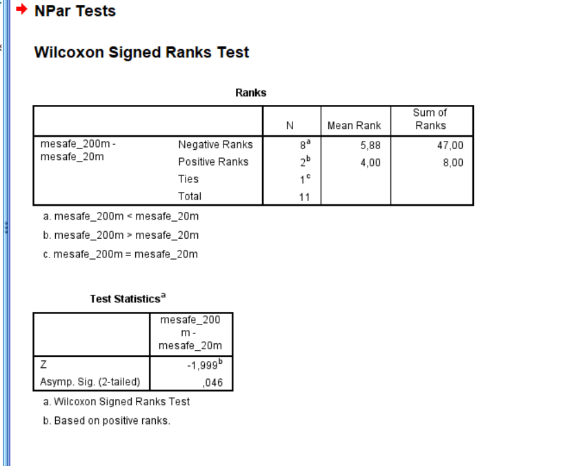

</details>

## Soru 6 – k bağımsız örneklem testi (Kruskal-Wallis)

- H₀: Kontrol ve üç koruyucu grubunun medyan bakteri sayıları eşittir.
- H₁: Gruplardan en az birinin medyanı diğerlerinden farklıdır.

``` r
kw <- kruskal.test(log_bakteri ~ grup, data = bakteri)
kw
```

    ## 
    ##  Kruskal-Wallis rank sum test
    ## 
    ## data:  log_bakteri by grup
    ## Kruskal-Wallis chi-squared = 17.143, df = 3, p-value = 0.0006605

Kruskal-Wallis testi anlamlı olduğunda farkın hangi gruplardan
kaynaklandığı **Dunn testi** ile incelenir (SPSS’in kullandığı yöntem).
Dunn testi, Kruskal-Wallis ile aynı ortak sıralamayı kullanır:

``` r
dunn_testi <- function(x, g) {
  r  <- rank(x); N <- length(x); n <- table(g)
  t  <- table(x)
  bag_duz <- sum(t^3 - t) / (12 * (N - 1))          # eşit değer düzeltmesi
  ort_sira <- tapply(r, g, mean)
  ciftler <- combn(levels(g), 2)
  sonuc <- apply(ciftler, 2, \(cf) {
    se <- sqrt((N * (N + 1) / 12 - bag_duz) * (1 / n[cf[1]] + 1 / n[cf[2]]))
    z  <- unname((ort_sira[cf[1]] - ort_sira[cf[2]]) / se)
    c(z = z, p = 2 * pnorm(-abs(z)))
  })
  data.frame(
    karsilastirma = paste(ciftler[1, ], "-", ciftler[2, ]),
    z = round(sonuc["z", ], 3),
    p = round(sonuc["p", ], 4),
    p_bonferroni = round(pmin(1, sonuc["p", ] * ncol(ciftler)), 4)
  )
}

if (kw$p.value < 0.05) knitr::kable(dunn_testi(bakteri$log_bakteri, bakteri$grup))
```

| karsilastirma         |      z |      p | p_bonferroni |
|:----------------------|-------:|-------:|-------------:|
| Kontrol - Koruyucu1   |  2.746 | 0.0060 |       0.0361 |
| Kontrol - Koruyucu2   |  1.081 | 0.2796 |       1.0000 |
| Kontrol - Koruyucu3   |  3.745 | 0.0002 |       0.0011 |
| Koruyucu1 - Koruyucu2 | -1.730 | 0.0836 |       0.5018 |
| Koruyucu1 - Koruyucu3 |  1.117 | 0.2642 |       1.0000 |
| Koruyucu2 - Koruyucu3 |  2.795 | 0.0052 |       0.0312 |

Karşılaştırma için Bonferroni düzeltmeli ikili Mann-Whitney testleri:

``` r
pairwise.wilcox.test(bakteri$log_bakteri, bakteri$grup, p.adjust.method = "bonferroni")
```

    ## 
    ##  Pairwise comparisons using Wilcoxon rank sum exact test 
    ## 
    ## data:  bakteri$log_bakteri and bakteri$grup 
    ## 
    ##           Kontrol Koruyucu1 Koruyucu2
    ## Koruyucu1 0.057   -         -        
    ## Koruyucu2 0.095   0.026     -        
    ## Koruyucu3 0.057   0.390     0.026    
    ## 
    ## P value adjustment method: bonferroni

**Yorum.** Kruskal-Wallis testinde p = 6.6^{-4} \< 0.05 olduğundan H₀
reddedilir; dört grup arasında anlamlı fark vardır.

Dunn testine (Bonferroni düzeltmeli) göre:

- **Koruyucu 1** ve **Koruyucu 3**, kontrol grubundan anlamlı olarak
  farklıdır (düzeltilmiş p = 0.036 ve 0.001); bu iki koruyucu bakteri
  sayısını belirgin biçimde düşürmüştür.
- **Koruyucu 2** kontrolden anlamlı farklı değildir (p = 1.000), ancak
  Koruyucu 3’ten anlamlı farklıdır (p = 0.031).

İkili Mann-Whitney testleri daha temkinli sonuç verir: her grupta en
fazla 6 gözlem olduğu için kesin p-değerlerinin alabileceği en küçük
değer yüksektir ve düzeltme sonrası yalnızca Koruyucu 2’nin Koruyucu 1
ve 3’ten farkı anlamlı kalır. Kruskal-Wallis sonrası standart post-hoc
yöntem Dunn testi olduğundan yorum Dunn sonuçlarına dayandırılmıştır.

<details>
<summary>
<b>SPSS çıktıları</b>
</summary>

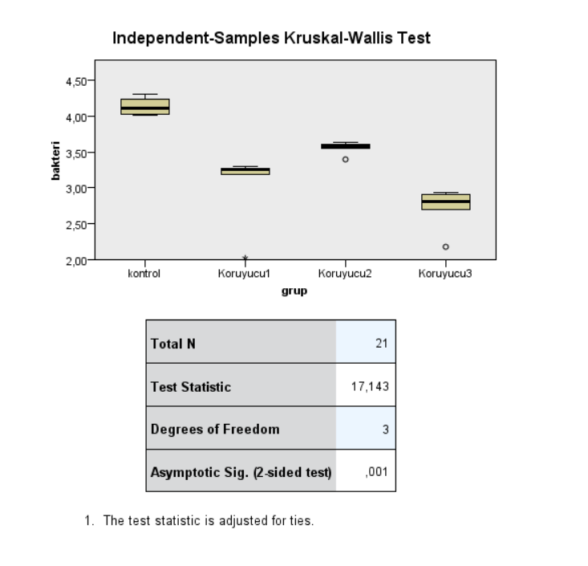 

</details>

## Soru 7 – k bağımlı örneklem testi (Friedman)

- H₀: Rüzgâr kırana olan mesafenin toprak sıcaklığı üzerinde etkisi
  yoktur.
- H₁: Mesafelerden en az biri toprak sıcaklığı açısından diğerlerinden
  farklıdır.

Aylar blok, mesafeler işlem olarak alınmıştır:

``` r
fr <- friedman.test(toprak_genis)
fr
```

    ## 
    ##  Friedman rank sum test
    ## 
    ## data:  toprak_genis
    ## Friedman chi-squared = 7.1818, df = 3, p-value = 0.06632

``` r
if (fr$p.value < 0.05) {
  pairwise.wilcox.test(toprak$sicaklik, toprak$mesafe,
                       paired = TRUE, p.adjust.method = "bonferroni")
} else {
  "p > 0.05: post-hoc karşılaştırmaya gerek yoktur."
}
```

    ## [1] "p > 0.05: post-hoc karşılaştırmaya gerek yoktur."

**Yorum.** Friedman testinde p = 0.0663 \> 0.05 olduğundan H₀
reddedilemez. %95 güven düzeyinde mesafenin (20, 40, 100, 200 m) toprak
sıcaklığı üzerinde anlamlı bir fark yaratmadığı sonucuna varılır. Bu
sonuç, Soru 2’deki birbirine çok yakın ortalamalar (40.0–40.2 °C) ve üst
üste binen çizgilerle tutarlıdır.

<details>
<summary>
<b>SPSS çıktıları</b>
</summary>

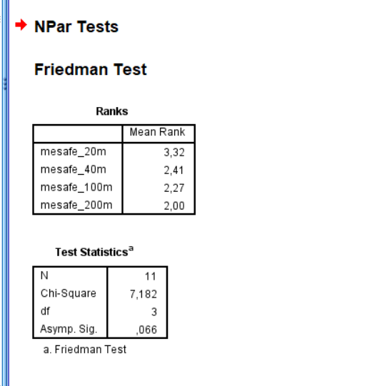

</details>

## Soru 8 – Eğilim testi (Mann-Kendall, 20 m)

- H₀: 20 m mesafedeki sıcaklıklarda aylar boyunca monoton bir eğilim
  yoktur.
- H₁: Monoton artan ya da azalan bir eğilim vardır.

``` r
x20 <- toprak_genis[, "20m"]

plot(seq_along(x20), x20, type = "o", col = "darkred", pch = 19, lwd = 2,
     xaxt = "n", xlab = "", ylab = "Sıcaklık (°C)",
     main = "Aylara Göre Toprak Sıcaklığı (20 m)")
axis(1, at = seq_along(x20), labels = names(x20), las = 2)
```

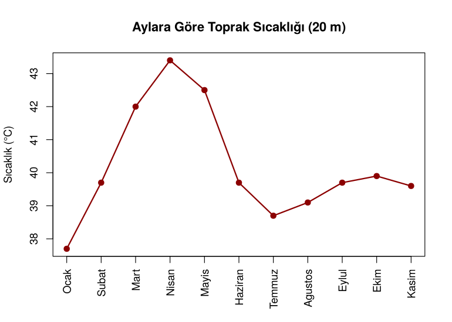<!-- -->

``` r
# Mann-Kendall testi (Kendall::MannKendall ile aynı sonucu verir:
# eşit değer düzeltmeli varyans ve süreklilik düzeltmesi)
mann_kendall <- function(x) {
  n <- length(x)
  S <- sum(sapply(1:(n - 1), \(i) sum(sign(x[(i + 1):n] - x[i]))))
  t <- table(x)
  v <- (n * (n - 1) * (2 * n + 5) - sum(t * (t - 1) * (2 * t + 5))) / 18
  z <- if (S > 0) (S - 1) / sqrt(v) else if (S < 0) (S + 1) / sqrt(v) else 0
  tau <- cor(seq_along(x), x, method = "kendall")
  c(S = S, tau = round(tau, 4), z = round(z, 4), p = round(2 * pnorm(-abs(z)), 5))
}
mk <- mann_kendall(x20)
mk
```

    ##        S      tau        z        p 
    ## -2.00000 -0.03740 -0.07870  0.93725

**Yorum.** τ = -0.0374, p = 0.93725 \> 0.05 olduğundan H₀ reddedilemez;
**20 m mesafesindeki** toprak sıcaklığında aylar boyunca anlamlı bir
monoton eğilim yoktur. Grafikte görüldüğü gibi sıcaklık nisana kadar
yükselip sonra düşmektedir. Bu mevsimsel (artıp azalan) yapı,
Mann-Kendall testinin aradığı tek yönlü eğilimden farklıdır.

> SPSS’in menülerinde Mann-Kendall testi bulunmadığından bu soru
> yalnızca R ile yapılmıştır.

## Sonuç özeti

| Soru | Test                     | Sonuç (α = 0.05)                                                 |
|------|--------------------------|------------------------------------------------------------------|
| 1    | Shapiro-Wilk             | Koruyucu 1 ve 3 normal değil → parametrik olmayan yöntem         |
| 2    | Shapiro-Wilk             | Normallik sağlanıyor ama n küçük, aykırı değer ve bağımlılık var |
| 3    | İşaret, Wilcoxon         | Koruyucu 2 medyanı 3.5’ten farklı değil                          |
| 4    | Mann-Whitney U           | Kontrol ile Koruyucu 2 farklı (düzeltmesiz)                      |
| 5    | Wilcoxon (eşleştirilmiş) | Sınırda (p = 0.046–0.051); fark çok küçük                        |
| 6    | Kruskal-Wallis + Dunn    | Gruplar farklı; Koruyucu 1 ve 3 kontrolden farklı                |
| 7    | Friedman                 | Mesafenin etkisi yok                                             |
| 8    | Mann-Kendall             | 20 m’de monoton eğilim yok                                       |

## Kaynaklar

- Higgins, J. J. (2004). *Introduction to Modern Nonparametric
  Statistics*. Brooks/Cole.
- Hollander, M., & Wolfe, D. A. (1999). *Nonparametric Statistical
  Methods* (2nd ed.). Wiley.
